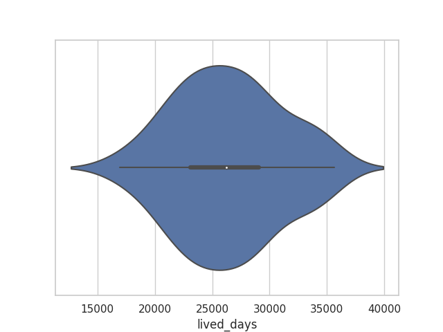
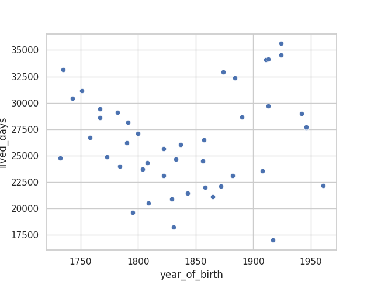

# President Age report

Author: Patrick White
Date: 2022-04-04

## Overview

Our presidents are getting older. However this cannot be ascribed to just advancing medical science since
the lived days year of birth correlation is quadratic. JFK is an obvious outlier and should probably be
removed along with McKinley.

Further analysis should include the years over which the president served. Anecdotally we see that presidents
visibly age over the course of their service. The author wonders what the data would show.

### Plots

## Methodology

### Cleaning and Preparation

The original dataset contained a row which did not have information pertinent to a presidents lifespan. This was dropped.
Many current and former presidents are still alive so a synthetic death date was added on the date that
this report and analysis was generated. This date is 2022-04-04. If you are reading this
report after, please adjust the already considerable ages upward or rerun the code `main.py`.

### Variables

The enhanced dataset contains variables called `lived_years` and `lived_months`. These measures are "floored". This
means that if someone is one day before their 100th birthday on the day this report was run,
this report would count them as having a `lived_years` of 99.

### `lived_days` aggregate measures

In the appendix there are aggregate measures for the `lived_days` variable. The brief for this report says to include
a weighted mean but does not provide weights with which one could weight the mean, so it was not calculated. At the
time of running the report every `lived_days` value was unique so no mode could be calculated.

## Appendix

CSV versions of the following file can be found in the same directory as this report.

### Enhanced Data

| PRESIDENT              | BIRTH DATE    | BIRTH PLACE             | DEATH DATE    | LOCATION OF DEATH     |   year_of_birth |   lived_days |   lived_years |   lived_months |
|:-----------------------|:--------------|:------------------------|:--------------|:----------------------|----------------:|-------------:|--------------:|---------------:|
| John F. Kennedy        | May 29, 1917  | Brookline, Mass.        | Nov 22, 1963  | Dallas, Texas         |            1917 |        16978 |            46 |            570 |
| James A. Garfield      | Nov 19, 1831  | Cuyahoga Co., Ohio      | Sep 19, 1881  | Elberon, New Jersey   |            1831 |        18202 |            49 |            598 |
| James K. Polk          | Nov 2, 1795   | Mecklenburg Co., N.C.   | June 15, 1849 | Nashville, Tennessee  |            1795 |        19583 |            53 |            643 |
| Abraham Lincoln        | Feb 12, 1809  | LaRue Co., Kentucky     | Apr 15, 1865  | Washington, D.C.      |            1809 |        20516 |            56 |            686 |
| Chester Arthur         | Oct 5, 1829   | Fairfield, Vermont      | Nov 18, 1886  | New York, New York    |            1829 |        20863 |            57 |            697 |
| Warren G. Harding      | Nov 2, 1865   | Morrow County, Ohio     | Aug 2, 1923   | San Francisco, Cal.   |            1865 |        21091 |            57 |            693 |
| William McKinley       | Jan 29, 1843  | Niles, Ohio             | Sep 14, 1901  | Buffalo, New York     |            1843 |        21412 |            58 |            716 |
| Theodore Roosevelt     | Oct 27, 1858  | New York, New York      | Jan 6, 1919   | Oyster Bay, New York  |            1858 |        21985 |            60 |            723 |
| Calvin Coolidge        | July 4, 1872  | Plymouth, Vermont       | Jan 5, 1933   | Northampton, Mass.    |            1872 |        22099 |            60 |            726 |
| Barack Obama           | Aug 4, 1961   | Honolulu, Hawaii        | nan           | nan                   |            1961 |        22158 |            60 |            728 |
| Franklin Roosevelt     | Jan 30, 1882  | Hyde Park, New York     | Apr 12, 1945  | Warm Springs, Ga.     |            1882 |        23082 |            63 |            771 |
| Ulysses S. Grant       | Apr 27, 1822  | Point Pleasant, Ohio    | July 23, 1885 | Wilton, New York      |            1822 |        23098 |            63 |            771 |
| Lyndon B. Johnson      | Aug 27, 1908  | Gillespie Co., Texas    | Jan 22, 1973  | Gillespie Co., Texas  |            1908 |        23524 |            64 |            773 |
| Franklin Pierce        | Nov 23, 1804  | Hillsborough, N.H.      | Oct 8, 1869   | Concord, New Hamp.    |            1804 |        23695 |            64 |            779 |
| Zachary Taylor         | Nov 24, 1784  | Orange County, Va.      | July 9, 1850  | Washington, D.C       |            1784 |        23967 |            65 |            788 |
| Andrew Johnson         | Dec 29, 1808  | Raleigh, North Carolina | July 31, 1875 | Elizabethton, Tenn.   |            1808 |        24320 |            66 |            799 |
| Woodrow Wilson         | Dec 28, 1856  | Staunton, Virginia      | Feb 3, 1924   | Washington, D.C.      |            1856 |        24507 |            67 |            806 |
| Benjamin Harrison      | Aug 20, 1833  | North Bend, Ohio        | Mar 13, 1901  | Indianapolis, Indiana |            1833 |        24676 |            67 |            811 |
| George Washington      | Feb 22, 1732  | Westmoreland Co., Va.   | Dec 14, 1799  | Mount Vernon, Va.     |            1732 |        24767 |            67 |            826 |
| William Henry Harrison | Feb 9, 1773   | Charles City Co., Va.   | Apr 4, 1841   | Washington, D.C.      |            1773 |        24890 |            68 |            830 |
| Rutherford B. Hayes    | Oct 4, 1822   | Delaware, Ohio          | Jan 17, 1893  | Fremont, Ohio         |            1822 |        25673 |            70 |            843 |
| Grover Cleveland       | Mar 18, 1837  | Caldwell, New Jersey    | June 24, 1908 | Princeton, New Jersey |            1837 |        26030 |            71 |            867 |
| John Tyler             | Mar 29, 1790  | Charles City Co., Va.   | Jan 18, 1862  | Richmond, Va.         |            1790 |        26227 |            71 |            862 |
| William Howard Taft    | Sep 15, 1857  | Cincinnati, Ohio        | Mar 8, 1930   | Washington, D.C.      |            1857 |        26471 |            72 |            870 |
| James Monroe           | Apr 28, 1758  | Westmoreland Co., Va.   | July 4, 1831  | New York, New York    |            1758 |        26729 |            73 |            891 |
| Millard Fillmore       | Jan 7, 1800   | Cayuga Co., New York    | Mar 8, 1874   | Buffalo, New York     |            1800 |        27088 |            74 |            902 |
| Bill Clinton           | Aug 19, 1946  | Hope, Arkansas          | nan           | nan                   |            1946 |        27622 |            75 |            908 |
| George W. Bush         | July 6, 1946  | New Haven, Conn.        | nan           | nan                   |            1946 |        27666 |            75 |            909 |
| Donald Trump           | June 14, 1946 | New York, New York      | nan           | nan                   |            1946 |        27688 |            75 |            910 |
| James Buchanan         | Apr 23, 1791  | Cove Gap, Pa.           | June 1, 1868  | Lancaster, Pa.        |            1791 |        28163 |            77 |            938 |
| Andrew Jackson         | Mar 15, 1767  | Waxhaws, No/So Carolina | June 8, 1845  | Nashville, Tennessee  |            1767 |        28574 |            78 |            951 |
| Dwight Eisenhower      | Oct 14, 1890  | Denison, Texas          | Mar 28, 1969  | Washington, D.C.      |            1890 |        28654 |            78 |            941 |
| Joe Biden              | Nov 20, 1942  | Scranton, Pa.           | nan           | nan                   |            1942 |        28990 |            79 |            953 |
| Martin Van Buren       | Dec 5, 1782   | Kinderhook, New York    | July 24, 1862 | Kinderhook, New York  |            1782 |        29085 |            79 |            955 |
| John Quincy Adams      | July 11, 1767 | Quincy, Mass.           | Feb 23, 1848  | Washington, D.C.      |            1767 |        29446 |            80 |            967 |
| Richard Nixon          | Jan 9, 1913   | Yorba Linda, Cal.       | Apr 22, 1994  | New York, New York    |            1913 |        29688 |            81 |            987 |
| Thomas Jefferson       | Apr 13, 1743  | Albemarle Co., Va.      | July 4, 1826  | Albemarle Co., Va.    |            1743 |        30397 |            83 |           1011 |
| James Madison          | Mar 16, 1751  | Port Conway, Va.        | June 28, 1836 | Orange Co., Va.       |            1751 |        31150 |            85 |           1035 |
| Harry S. Truman        | May 8, 1884   | Lamar, Missouri         | Dec 26, 1972  | Kansas City, Missouri |            1884 |        32373 |            88 |           1075 |
| Herbert Hoover         | Aug 10, 1874  | West Branch, Iowa       | Oct 20, 1964  | New York, New York    |            1874 |        32943 |            90 |           1094 |
| John Adams             | Oct 30, 1735  | Quincy, Mass.           | July 4, 1826  | Quincy, Mass.         |            1735 |        33119 |            90 |           1089 |
| Ronald Reagan          | Feb 6, 1911   | Tampico, Illinois       | June 5, 2004  | Los Angeles, Cal.     |            1911 |        34088 |            93 |           1132 |
| Gerald Ford            | July 14, 1913 | Omaha, Nebraska         | Dec 26, 2006  | Rancho Mirage, Cal.   |            1913 |        34133 |            93 |           1133 |
| George Bush            | June 12, 1924 | Milton, Mass.           | Nov 30, 2018  | Houston, Texas        |            1924 |        34504 |            94 |           1145 |
| Jimmy Carter           | Oct 1, 1924   | Plains, Georgia         | nan           | nan                   |            1924 |        35614 |            97 |           1170 |

### Shortest Lived Presidents

| PRESIDENT          | BIRTH DATE   | BIRTH PLACE           | DEATH DATE    | LOCATION OF DEATH    |   year_of_birth |   lived_days |   lived_years |   lived_months |
|:-------------------|:-------------|:----------------------|:--------------|:---------------------|----------------:|-------------:|--------------:|---------------:|
| John F. Kennedy    | May 29, 1917 | Brookline, Mass.      | Nov 22, 1963  | Dallas, Texas        |            1917 |        16978 |            46 |            570 |
| James A. Garfield  | Nov 19, 1831 | Cuyahoga Co., Ohio    | Sep 19, 1881  | Elberon, New Jersey  |            1831 |        18202 |            49 |            598 |
| James K. Polk      | Nov 2, 1795  | Mecklenburg Co., N.C. | June 15, 1849 | Nashville, Tennessee |            1795 |        19583 |            53 |            643 |
| Abraham Lincoln    | Feb 12, 1809 | LaRue Co., Kentucky   | Apr 15, 1865  | Washington, D.C.     |            1809 |        20516 |            56 |            686 |
| Chester Arthur     | Oct 5, 1829  | Fairfield, Vermont    | Nov 18, 1886  | New York, New York   |            1829 |        20863 |            57 |            697 |
| Warren G. Harding  | Nov 2, 1865  | Morrow County, Ohio   | Aug 2, 1923   | San Francisco, Cal.  |            1865 |        21091 |            57 |            693 |
| William McKinley   | Jan 29, 1843 | Niles, Ohio           | Sep 14, 1901  | Buffalo, New York    |            1843 |        21412 |            58 |            716 |
| Theodore Roosevelt | Oct 27, 1858 | New York, New York    | Jan 6, 1919   | Oyster Bay, New York |            1858 |        21985 |            60 |            723 |
| Calvin Coolidge    | July 4, 1872 | Plymouth, Vermont     | Jan 5, 1933   | Northampton, Mass.   |            1872 |        22099 |            60 |            726 |
| Barack Obama       | Aug 4, 1961  | Honolulu, Hawaii      | nan           | nan                  |            1961 |        22158 |            60 |            728 |

### Longest Lived Presidents

| PRESIDENT        | BIRTH DATE    | BIRTH PLACE        | DEATH DATE    | LOCATION OF DEATH     |   year_of_birth |   lived_days |   lived_years |   lived_months |
|:-----------------|:--------------|:-------------------|:--------------|:----------------------|----------------:|-------------:|--------------:|---------------:|
| Jimmy Carter     | Oct 1, 1924   | Plains, Georgia    | nan           | nan                   |            1924 |        35614 |            97 |           1170 |
| George Bush      | June 12, 1924 | Milton, Mass.      | Nov 30, 2018  | Houston, Texas        |            1924 |        34504 |            94 |           1145 |
| Gerald Ford      | July 14, 1913 | Omaha, Nebraska    | Dec 26, 2006  | Rancho Mirage, Cal.   |            1913 |        34133 |            93 |           1133 |
| Ronald Reagan    | Feb 6, 1911   | Tampico, Illinois  | June 5, 2004  | Los Angeles, Cal.     |            1911 |        34088 |            93 |           1132 |
| John Adams       | Oct 30, 1735  | Quincy, Mass.      | July 4, 1826  | Quincy, Mass.         |            1735 |        33119 |            90 |           1089 |
| Herbert Hoover   | Aug 10, 1874  | West Branch, Iowa  | Oct 20, 1964  | New York, New York    |            1874 |        32943 |            90 |           1094 |
| Harry S. Truman  | May 8, 1884   | Lamar, Missouri    | Dec 26, 1972  | Kansas City, Missouri |            1884 |        32373 |            88 |           1075 |
| James Madison    | Mar 16, 1751  | Port Conway, Va.   | June 28, 1836 | Orange Co., Va.       |            1751 |        31150 |            85 |           1035 |
| Thomas Jefferson | Apr 13, 1743  | Albemarle Co., Va. | July 4, 1826  | Albemarle Co., Va.    |            1743 |        30397 |            83 |           1011 |
| Richard Nixon    | Jan 9, 1913   | Yorba Linda, Cal.  | Apr 22, 1994  | New York, New York    |            1913 |        29688 |            81 |            987 |

### Lived Days aggregate measures

| column_name   | date_calculated   |    mean |   median |   max |   min |   standard_deviation | mode   | weighted_mean   |
|:--------------|:------------------|--------:|---------:|------:|------:|---------------------:|:-------|:----------------|
| lived_days    | 2022-04-04        | 26389.5 |    26227 | 35614 | 16978 |              4574.22 | N/A    | N/A             |

